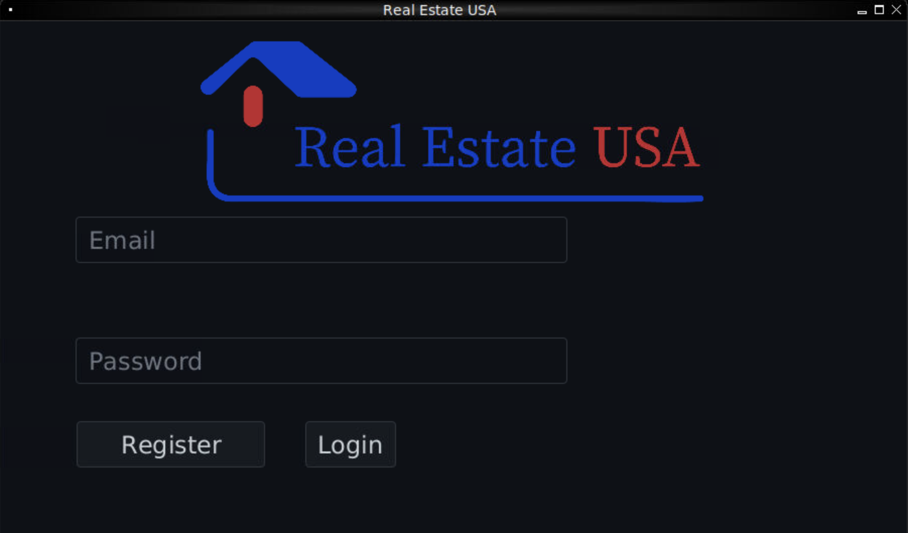

# Real Estate USA System




## Project Overview
This project is an integrative solution developed for the Degree in Informatics Engineering (LEI) at Instituto Superior de Engenharia do Porto (ISEP). It represents a comprehensive real estate management application for a fictional company called "Real Estate USA".

The project integrates knowledge and competencies from multiple courses in the 2nd semester curriculum:
- ESOFT - Software development process
- PPROG - Java OO programming
- MDISC - Worst-case time complexity of sorting and Balanced Partition algorithm
- MATCP - Linear regression and prediction tasks
- LAPR2 - Team management, working methodology, integration of modules

## Business Context
Real Estate USA is a company with a network of real estate agencies across the United States that requires an application to manage their business operations for property leasing and sales.

### Key Features
- Property listing management (rental and sale advertisements)
- Business registration (lease or sale)
- Property visit scheduling
- Client property browsing
- Employee operations management
- Commission calculation
- Store and network management
- Performance analysis

## System Users
- **Property Owners**: Register properties for sale/rent
- **Clients/Buyers**: Browse properties and schedule visits
- **Real Estate Agents**: Manage property listings and client visits
- **Store Managers**: Monitor branch operations and employee performance
- **Network Managers**: Analyze performance across branches
- **System Administrator**: Manage employees and branches

## Technical Requirements
- Developed in Java
- IDE: IntelliJ or NetBeans
- GUI: JavaFX 11
- Authentication: Password-based (7+ alphanumeric with 3 capital letters and 2 digits)
- Language Support: English
- Documentation: Javadoc
- Testing: JUnit 5 framework with JaCoCo for coverage reports
- Image format: SVG
- Data persistence: Object serialization

## Architecture

The application follows a layered architecture pattern with:

- **Domain Layer**: Core business entities and logic
- **Repository Layer**: Data persistence and retrieval
- **Application Layer**: Controllers that coordinate operations
- **UI Layer**: User interface components

The system uses a repository pattern for data access, making it easy to switch between different storage mechanisms.

## Getting Started

> **Note:** To run the application using Docker containers, please refer to [README-DOCKER.md](README-DOCKER.md) for detailed instructions.

### Prerequisites

- Java JDK 11 or higher
- Maven 3.6 or higher
- IntelliJ IDE or NetBeans
- JavaFX 11

### Installation

1. Clone the repository:
   ```bash
   git clone https://github.com/yourusername/real-estate-usa.git
   cd real-estate-usa
   ```

2. Build the project with Maven:
   ```bash
   mvn clean install
   ```

3. Run the application:
   ```bash
   mvn javafx:run
   ```

   This will launch the JavaFX GUI application.

### Default Users

The system comes pre-configured with the following users:

| Username | Email | Password | Role |
|----------|-------|----------|------|
| MainAdministrator | admin@realestate.app | Admin123 | Administrator |
| Agent1 | agent1@realestate.app | Agent123 | Employee |
| Client1 | client1@realestate.app | Client123 | Client |
| StoreManager1 | manager1@realestate.app | Manager123 | Store Manager |
| NetworkManager | network@realestate.app | Network123 | Network Manager |

## Development

### Project Structure

- `src/main/java/pt/ipp/isep/dei/esoft/project/`
    - `domain/` - Business entities and value objects
        - `model/` - Core business objects (Property, Agent, Client, etc.)
        - `shared/` - Value objects and shared components
    - `repository/` - Data access objects
    - `application/controller/` - Application logic
    - `ui/` - User interface components
        - `console/` - Console UI implementation
        - `gui/` - JavaFX GUI implementation
    - `utils/` - Utility classes

### Sprint Structure

The project follows a sprint-based development process:
- **Sprint A (Weeks 4-6)**: Basic ER and OO skills, Software Testing, Continuous Integration
- **Sprint B (Weeks 7-9)**: Advanced ER/OO/DOO/COO skills, Console UI development
- **Sprint C (Weeks 10-12)**: Continued development of modules, Console UI refinement
- **Sprint D (Weeks 13-15)**: Completion of all modules, GUI implementation with JavaFX

### Running Tests

```bash
# Run all tests
mvn clean test

# Generate test coverage report
mvn test jacoco:report

# Check if coverage thresholds are achieved
mvn test jacoco:check

# Generate mutation testing report
mvn org.pitest:pitest-maven:mutationCoverage
```

### Generating Documentation

```bash
# Generate source code documentation
mvn javadoc:javadoc

# Generate test code documentation
mvn javadoc:test-javadoc
```

## Data Persistence

The application uses Java serialization for data persistence. Data is saved to a file named `RealEstateUSA.ser`. On startup, the application checks if this file exists:

- If it exists, it deserializes the data and only runs the user bootstrap
- If it doesn't exist, it runs the full bootstrap and creates a new serialized file

## UML Diagrams

UML diagrams can be generated using PlantUML. Run the following script from the project root:

```bash
bin/generate-plantuml-diagrams.sh
```

All images and figures produced during development should be recorded in SVG format as specified in the technical requirements.

## Project Team
This project is designed to be completed by teams of 4 students working across all courses in the 2nd semester curriculum.

## Acknowledgments

* Instituto Superior de Engenharia do Porto (ISEP)
* Degree in Informatics Engineering (LEI)
* Project Coordinators and Course Professors