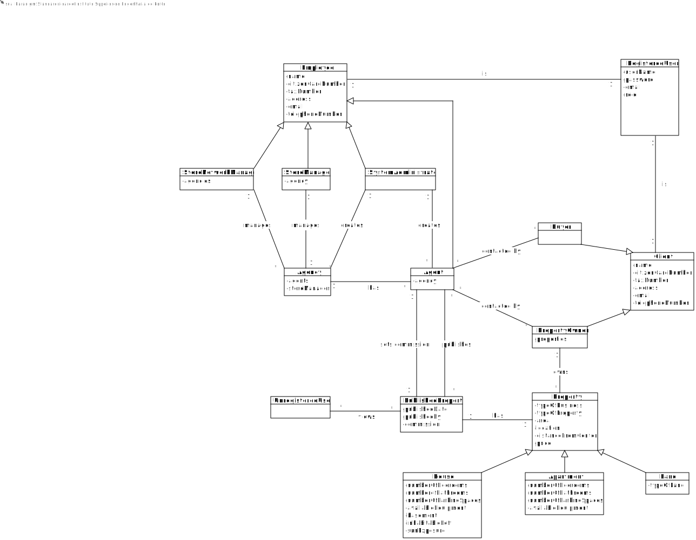

# Analysis

The construction process of the domain model is based on the client specifications, especially the nouns (for _concepts_) and verbs (for _relations_) used. 

## Rationale to identify domain conceptual classes ##
To identify domain conceptual classes, start by making a list of candidate conceptual classes inspired by the list of categories suggested in the book "Applying UML and Patterns: An Introduction to Object-Oriented Analysis and Design and Iterative Development". 

### _Conceptual Class Category List_ ###

**Business Transactions**

* Sale
* Rent
* Payment

---

**Transaction Line Items**

* Published Property

---

**Product/Service related to a Transaction or Transaction Line Item**

* Property

---

**Transaction Records**

* For a Sale Order:
  * Inputs:
    * Property information (price, address, etc.)
    * Property Owner information (name, tax number, etc.)
  * Outputs:
    * Sale Order (with the property information)
    * Sale Order Published Date
* For a Scheduled Visit:
    * Inputs:
      * Property information (price, address, etc.)
      * Property Owner information (name, tax number, etc.)
      * Buyer information (name, tax number, etc.)
    * Outputs:
      * Visit Order (with the property information)
      * Visit Order Schedule Date
* For an Offer:
  * Inputs:
    * Property information (price, address, etc.)
    * Property Owner information (name, tax number, etc.)
    * Buyer information (name, tax number, etc.)
---  

**Roles of People or Organizations**

* Agent
* Store Manager
* Store Network Manager
* System Administrator
* Property Owner
* Buyer
* Unregistered User

---

**Places**

*  Agency
*  Property

---

**Noteworthy Events**

* User Registration
* User Login/Logout
* User Profile Update (Agent to Store Manager)
* User Profile Update (Store Manager to Store Network Manager)
* Filter and Sort
* Agency Creation
* Agency Update
* Agency Deletion
* Sale/Rent Order Creation/Update/Deletion
* Visit Order Creation/Update/Deletion\
* Offer Creation/Update/Deletion

---

**Physical Objects**

* n/a

---

**Descriptions of Things**

* n/a

---

**Catalogs**

*  n/a

---

**Containers**

* n/a

---

**Elements of Containers**

*  n/a

---

**Organizations**

*  n/a

---

**Other External/Collaborating Systems**

* n/a

---

**Records of finance, work, contracts, legal matters**

* n/a

---

**Financial Instruments**

* n/a

---

**Documents mentioned/used to perform some work/**

* n/a
---

**Rationale to identify associations between conceptual classes**

[//]: # (An association is a relationship between instances of objects that indicates a relevant connection and that is worth of remembering, or it is derivable from the List of Common Associations: )

[//]: # (+ **_A_** is physically or logically part of **_B_**)

[//]: # (+ **_A_** is physically or logically contained in/on **_B_**)

[//]: # (+ **_A_** is a description for **_B_**)

[//]: # (+ **_A_** known/logged/recorded/reported/captured in **_B_**)

[//]: # (+ **_A_** uses or manages or owns **_B_**)

[//]: # (+ **_A_** is related with a transaction &#40;item&#41; of **_B_**)

[//]: # (+ etc.)

| Concept (A) 		           |                       Association   	                       |                                            Concept (B) |
|--------------------------|:-----------------------------------------------------------:|-------------------------------------------------------:|
| Store Network Manager  	 |                       manages    		 	                       |                                                 Agency |
| Agency  	                |                  has   managed by		 	                   |                                Agent Store Manager |
| System Administrator  	  |                        creates  		 	                        |                                       Agent Agency |
| System Administrator  	  |                        updates  		 	                        |                                       Agent Agency |
| Property Owner  	        |            owns  contacts for Sale/Rent		 	             |                                    Property  Agent |
| Buyer 	                  | views   sorts and filters	 contacts for Purchase	 	 | Published Property  Published Property   Agent |
| Unregistered User 	      |              views   sorts and filters	 	               |             Published Property  Published Property |
| Agent 	                  |                        publishes	 	                         |                                               Property |

## Domain Model

[//]: # (**Do NOT forget to identify concepts attributes too.**)

[//]: # ()
[//]: # (**Insert below the Domain Model Diagram in a SVG format**)

