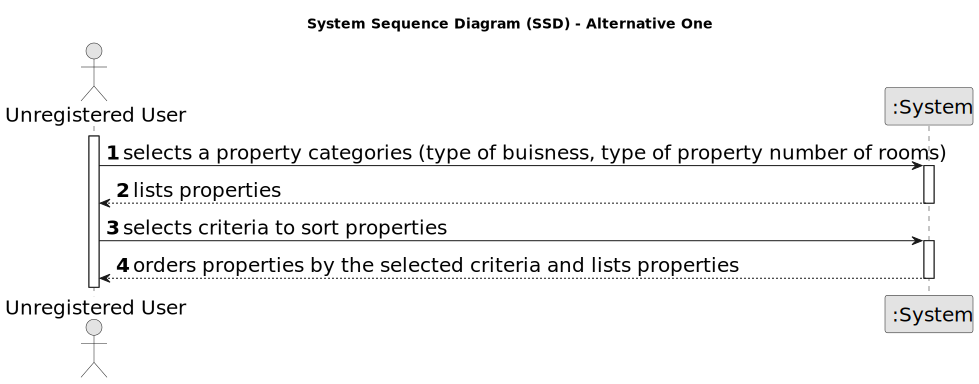
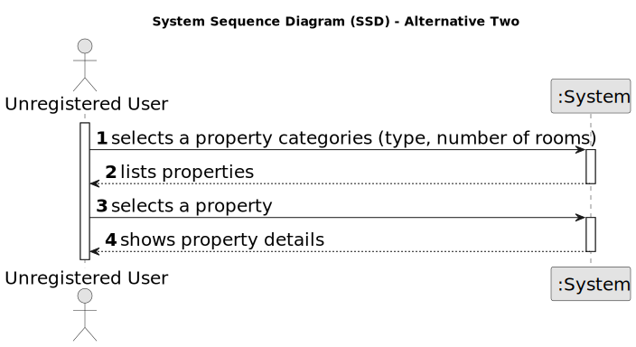
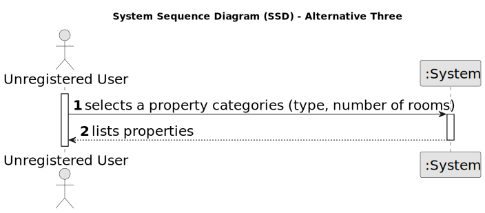

# US 001 - Display Listed Properties

## 1. Requirements Engineering

### 1.1. User Story Description

As an unregistered user, I want to display listed properties.

### 1.2. Customer Specifications and Clarifications 

**From the specifications document:**

>	Unregistered users are able to consult the properties by type, number of rooms, and sort by criteria such as price or the parish where the property is located.

**From the client clarifications:**

> Non-authenticated users can only list properties.

> The client should be able to select the type of business (renting or buying), the type of property and the number of rooms. Then, the client should be able to sort properties by price or by parish where the property is located.
 
> If the client does not select the type of business, the type of property and the number of rooms, the application should allow the client to sort all properties that are on sale or on renting.

> If the system does not contain any properties, the system should show an empty list of properties.

> **Question:** When an unregistered user opens the application, are there already properties being listed?
>  
> **Answer:** Yes.

> **Question:** Can the properties be in sale and lease at the same time?
>  
> **Answer:** No.

### 1.3. Acceptance Criteria

* **AC1:** The properties can be consulted by type of buisness, type of property and number of rooms.
* **AC2:** The properties can be sorted by price and parish.
* **AC3:** It is possible to only filter or only sort the properties.
* **AC4:** It is possible to filter and sort properties simultaneously.

### 1.4. Found out Dependencies

* There is a dependency to "US002 To publish a Sale" since listing the properties depends on what the agents published.

### 1.5 Input and Output Data

**Input Data:**
	
	
* Selected data:
	* Property type (filter)
    * Buinsess type (filter)
    * Number of rooms (filter)
    * Price (sort)
    * Parish (sort)

**Output Data:**

* List of properties

### 1.6. System Sequence Diagram (SSD)

**Other alternatives might exist.**

#### Alternative One

#### Alternative Two

#### Alternative Three

### 1.7 Other Relevant Remarks

*  An unregistered user must only be able to list properties, nothing else.