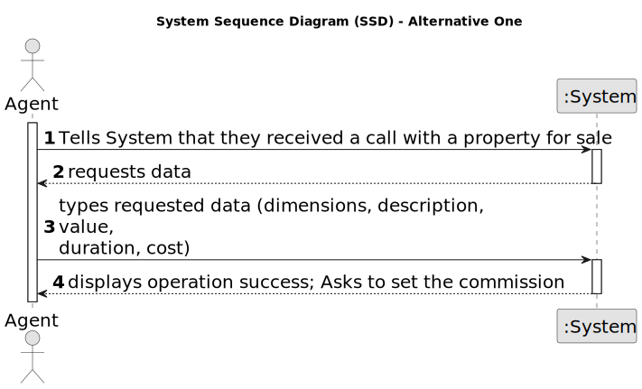

# US 002 - To publish a Sale

## 1. Requirements Engineering

### 1.1. User Story Description

As an agent, I can publish any sale announcement on the system, for
example received through a phone call.

### 1.2. Customer Specifications and Clarifications 

**From the specifications document:**

>	Agents are able to publish rental and/or sale advertisements 

>	The data for those advertisements are gathered from calls and in person meetings 

**From the client clarifications:**

> **Question:** Which is the unit of measurement used to estimate duration?
>  
> **Answer:** Duration is estimated in days.

### 1.3. Acceptance Criteria

* **AC1:** All required fields must be filled in.
* **AC2:** 
* **AC3:** 

### 1.4. Found out Dependencies

* There is a dependency to "US001 Create a task category" since at least a task category must exist to classify the task being created.

### 1.5 Input and Output Data

**Input Data:**

* Typed data:
	* a price, 
	* property characteristics
	
[//]: # (* Selected data:)

[//]: # (	* Classifying task category )

**Output Data:**

* Order requested
* (In)Success of the operation

### 1.6. System Sequence Diagram (SSD)

**Other alternatives might exist.**

#### Alternative One

### 1.7 Other Relevant Remarks

* 