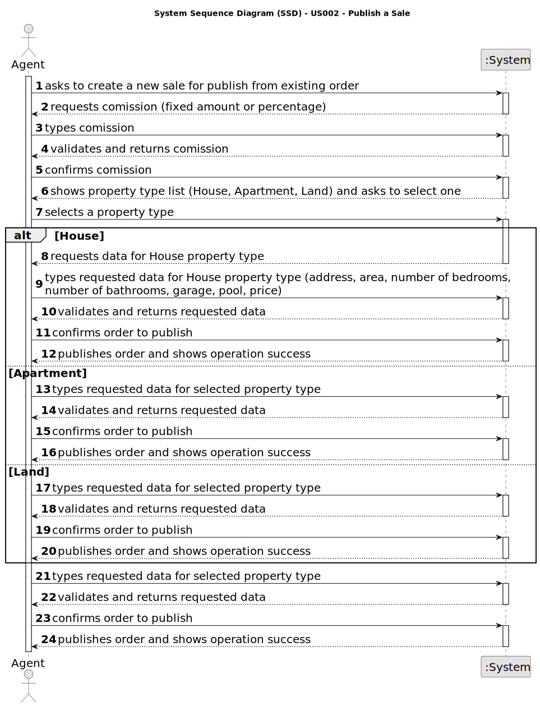

# US 002 - To publish a Sale

## 1. Requirements Engineering

### 1.1. User Story Description

As an agent, I can publish any sale announcement on the system, for
example received through a phone call.

### 1.2. Customer Specifications and Clarifications 

**From the specifications document:**

>	Agents are able to publish rental and/or sale advertisements 

>	The data for those advertisements are gathered from calls and in person meetings 

**From the client clarifications:**

> **Question:** Is the phone call the only way the agent can receive the sale announcement? Or he can receive them via e-mail/letter/etc
>  
> **Answer:** For now this is the only way.

> **Question:** What would be the attributes of the Owner and Agent?
>
> **Answer:** The Owner attributes are: the name, the citizen's card number, the tax number, the address, the email address and the contact
telephone number. The Agent is an employee of the company.

> **Question:** Does the agency have any commission (fixed or percentage) on top of the one that the agent sets, or the agent must set a commission that already includes the company's?
>
> **Answer:** The commission value includes the agent and the company commission.

### 1.3. Acceptance Criteria

* **AC1:** All required fields must be filled in and valid.
* **AC2:** All orders must be submitted through the system.

### 1.4. Found out Dependencies

* There is a dependency to "US004 Owner intends to submit sale or rent" since at least a property owner must exist so that a property can be published for sale.

### 1.5 Input and Output Data

**Input Data:**

* Typed data:
  * Owner:
      * a name,
      * a citizen's card number,
      * a tax number,
      * an address, 
      * an email address,
      * a contact telephone number.
  * Property:
    * an area (in m2),
    * a location,
    * a distance from the city centre,
    * a requested price,
    * a single or multiple photographs. 
      * Apartment or House:
        * a number of bedrooms,
        * a number of bathrooms,
        * a number of parking spaces,
        * any available equipment (such as central heating and/or air conditioning).
      * House:
        * existence of a basement,
        * existence of an inhabitable loft, 
        * a sun exposure value.
	
* Selected data: 
  * type of property (apartment, house or land),

[//]: # (	* Classifying task category )

**Output Data:**

* Number of request order,
* (In)Success of the operation

### 1.6. System Sequence Diagram (SSD)

**Other alternatives might exist.**

### 1.7 Other Relevant Remarks

* n/a