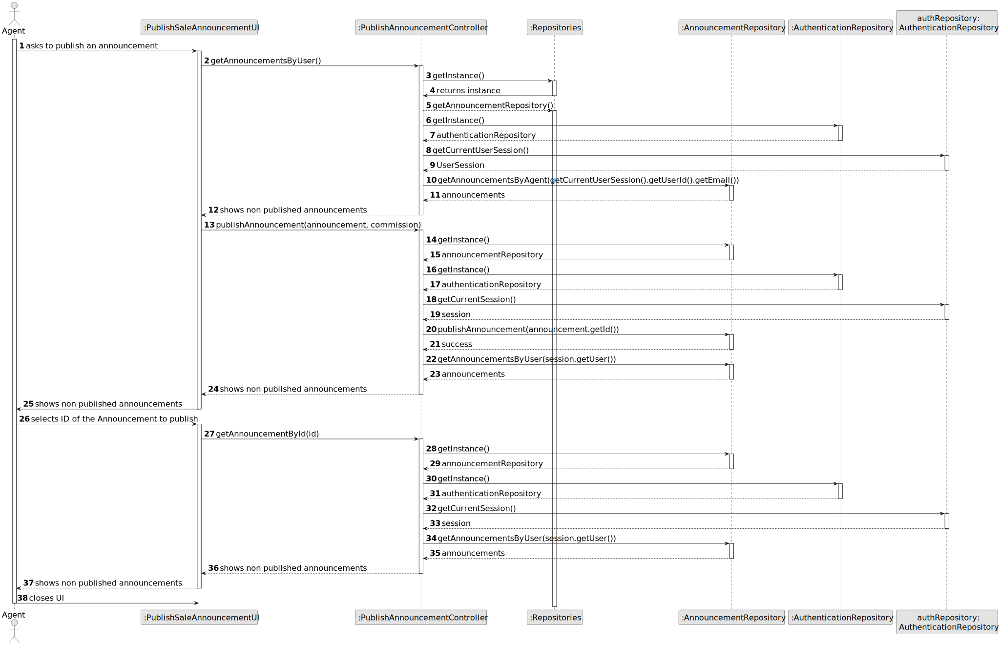
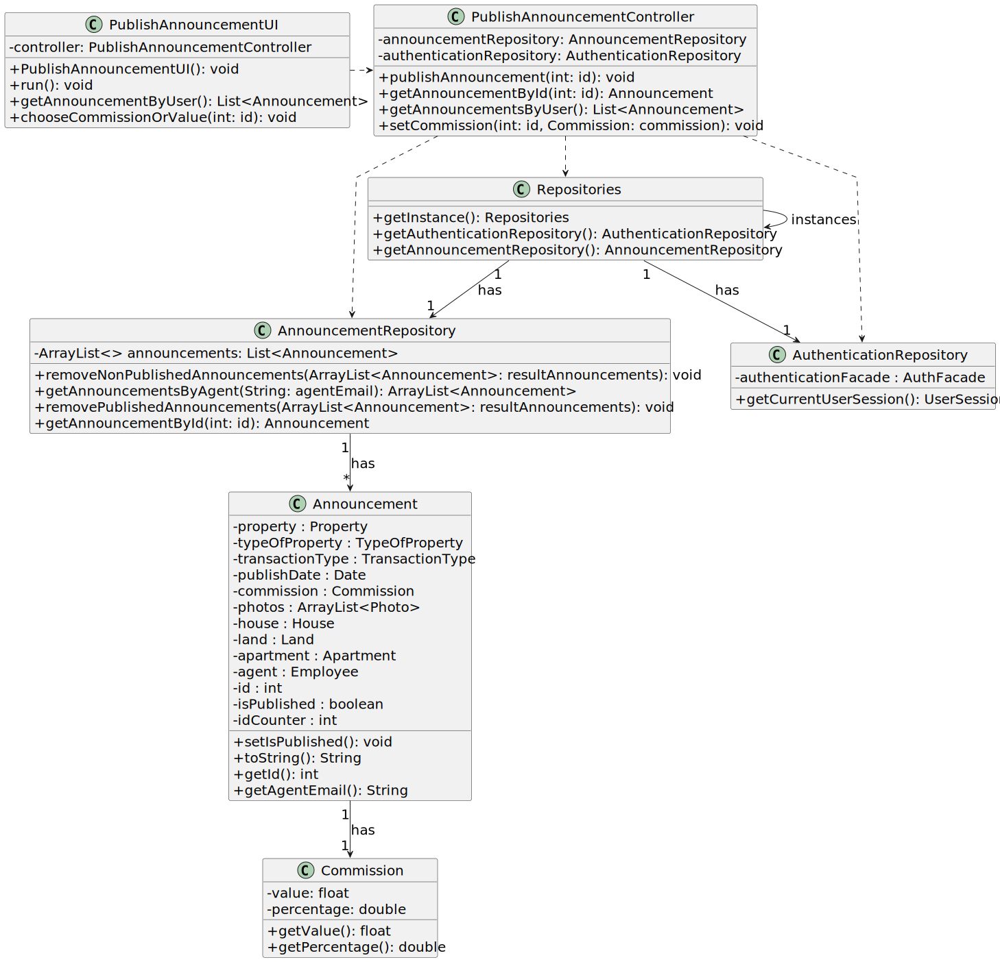

# US 002 - To publish a Sale

## 3. Design - User Story Realization 

### 3.1. Rationale

[//]: # (**SSD - Alternative 1 is adopted.**)
**SSD**

[//]: # ()
[//]: # (| Interaction ID                                     | Question: Which class is responsible for...   | Answer                        | Justification &#40;with patterns&#41;                                                                                 |)

[//]: # (|:---------------------------------------------------|:----------------------------------------------|:------------------------------|:--------------------------------------------------------------------------------------------------------------|)

[//]: # (| Step 1 : User requests to publish announcement  		 | 	... interacting with the actor?              | PublishAnnouncementUI         | Pure Fabrication: there is no reason to assign this responsibility to any existing class in the Domain Model. |)

[//]: # (| 			  		                                            | 	... coordinating the US?                     | PublishAnnouncementController | Controller                                                                                                    |)

[//]: # (| 			  		                                            | 	... instantiating a new Announcement?        | Announcement                  | Creator &#40;Rule 1&#41;: in the DM Organization has a Task.                                                          |)

[//]: # (| 			  		                                            | ... knowing the person using the system?        | UserSession                   |                                                                                                               |)

[//]: # (| 			  		                                            | 							                                       | Announcement                  | IE: knows/has its own Announcements                                                                           |)

[//]: # (| 			  		                                            | 							                                       | Property                      | IE: knows its own data &#40;e.g. TypeOfProperty&#41;                                                                  |)

[//]: # (| Step 2  		                                         | 							                                       |                               |                                                                                                               |)

[//]: # (| Step 3  		                                         | 	...saving the inputted data?                 | Task                          | IE: object created in step 1 has its own data.                                                                |)

[//]: # (| Step 4  		                                         | 	...knowing the task categories to show?      | System                        | IE: Task Categories are defined by the Administrators.                                                        |)

[//]: # (| Step 5  		                                         | 	... saving the selected category?            | Task                          | IE: object created in step 1 is classified in one Category.                                                   |)

[//]: # (| Step 6  		                                         | 							                                       |                               |                                                                                                               |              )

[//]: # (| Step 7  		                                         | 	... validating all data &#40;local validation&#41;?  | Task                          | IE: owns its data.                                                                                            | )

[//]: # (| 			  		                                            | 	... validating all data &#40;global validation&#41;? | Organization                  | IE: knows all its tasks.                                                                                      | )

[//]: # (| 			  		                                            | 	... saving the created task?                 | Organization                  | IE: owns all its tasks.                                                                                       | )

[//]: # (| Step 8  		                                         | 	... informing operation success?             | CreateTaskUI                  | IE: is responsible for person interactions.                                                                     | )

| Interaction ID                                    | Question: Which class is responsible for...              | Answer                        | Justification (with patterns)                                                                                 |
|---------------------------------------------------|----------------------------------------------------------|-------------------------------|---------------------------------------------------------------------------------------------------------------|
| Step 1 : User requests to publish announcement    | ... interacting with the agent?                          | PublishSaleAnnouncementUI     | Pure Fabrication: there is no reason to assign this responsibility to any existing class in the Domain Model. |
|                                                   | ... coordinating the use case?                           | PublishAnnouncementController | Controller                                                                                                    |
|                                                   | ... knowing the person using the system?                   | UserSession                   |                                                                                                               |
|                                                   | ... retrieving non-published announcements for the person? | AnnouncementRepository        | Information Expert                                                                                            |
|                                                   | ... retrieving the person's authentication session?        | AuthenticationRepository      | Information Expert                                                                                                    |
| Step 2 : UI retrieves non-published announcements | ... retrieving non-published announcements for the person? | AnnouncementRepository        | Information Expert                                                                                                    |
| Step 3 : User selects announcement to publish     | ... interacting with the agent?                          | PublishSaleAnnouncementUI     | Pure Fabrication: there is no reason to assign this responsibility to any existing class in the Domain Model. |
|                                                   | ... coordinating the use case?                           | PublishAnnouncementController | Controller                                                                                                    |
| Step 4 : User confirms publishing announcement    | ... interacting with the agent?                          | PublishSaleAnnouncementUI     | Pure Fabrication: there is no reason to assign this responsibility to any existing class in the Domain Model. |
|                                                   | ... coordinating the use case?                           | PublishAnnouncementController | Controller                                                                                                    |
|                                                   | ... publishing the selected announcement?                | AnnouncementRepository        | Information Expert                                                                                                    |
|                                                   | ... retrieving non-published announcements for the person? | AnnouncementRepository        | Information Expert                                                                                                    |
| Step 5 : UI retrieves non-published announcements | ... retrieving non-published announcements for the person? | AnnouncementRepository        | Information Expert                                                                                                    |

### Systematization ##

According to the taken rationale, the conceptual classes promoted to software classes are: 

 * Announcement

Other software classes (i.e. Pure Fabrication) identified: 

 * PublishAnnouncementUI  
 * PublishAnnouncementController
 * AnnouncementRepository
 * AuthenticationRepository

## 3.2. Sequence Diagram (SD)

This diagram shows the full sequence of interactions between the classes involved in the realization of this person story.

[//]: # (### Alternative 2 - Split Diagram)

[//]: # ()
[//]: # (This diagram shows the same sequence of interactions between the classes involved in the realization of this person story, but it is split in partial diagrams to better illustrate the interactions between the classes.)

[//]: # ()
[//]: # (It uses interaction ocurrence.)

[//]: # ()
[//]: # (![Sequence Diagram - split]&#40;svg/us002-sequence-diagram-split.svg&#41;)

[//]: # ()
[//]: # (**Get Task Category List Partial SD**)

[//]: # ()
[//]: # (![Sequence Diagram - Partial - Get Task Category List]&#40;svg/us002-sequence-diagram-partial-get-task-category-list.svg&#41;)

[//]: # ()
[//]: # (**Get Task Category Object**)

[//]: # ()
[//]: # (![Sequence Diagram - Partial - Get Task Category Object]&#40;svg/us002-sequence-diagram-partial-get-task-category.svg&#41;)

[//]: # ()
[//]: # (**Get Employee**)

[//]: # ()
[//]: # (![Sequence Diagram - Partial - Get Employee]&#40;svg/us002-sequence-diagram-partial-get-employee.svg&#41;)

[//]: # ()
[//]: # (**Create Task**)

[//]: # ()
[//]: # (![Sequence Diagram - Partial - Create Task]&#40;svg/us002-sequence-diagram-partial-create-task.svg&#41;)

## 3.3. Class Diagram (CD)

