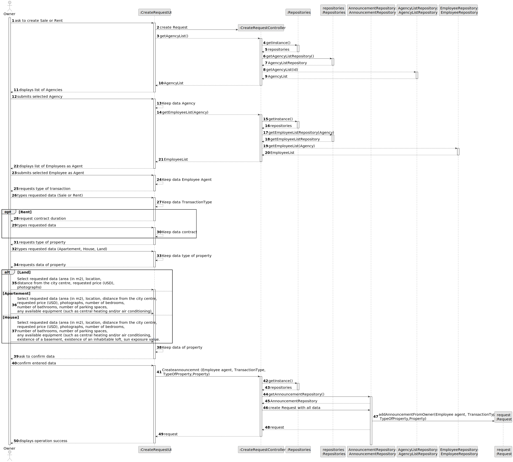
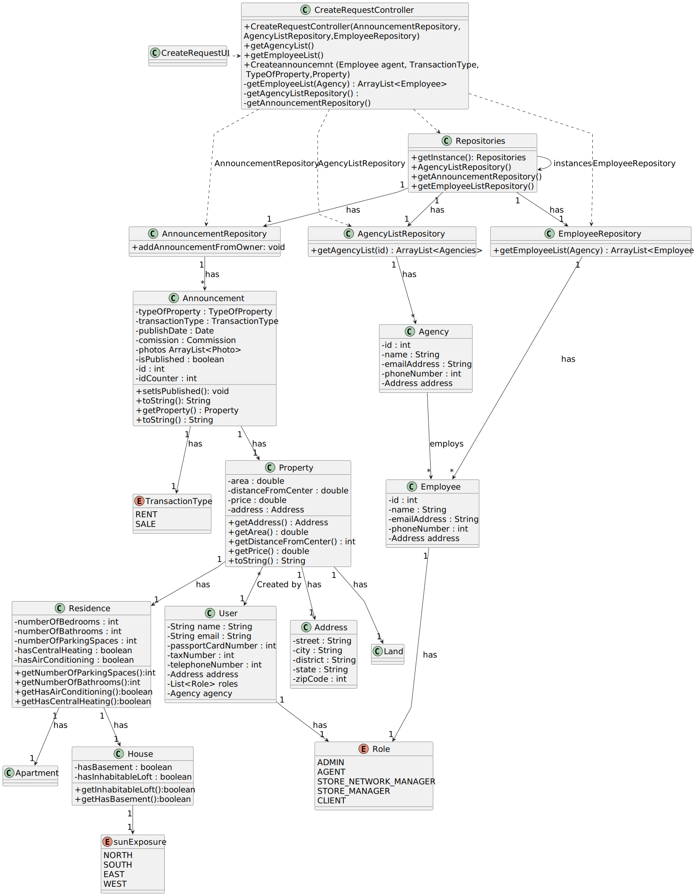

# US 004 - Owner submit sale or rent

## 3. Design - User Story Realization 

### 3.1. Rationale

**SSD - Alternative 1 is adopted.**

| Interaction ID                            | Question: Which class is responsible for...        | Answer                         | Justification (with patterns)                                       |
|:------------------------------------------|:---------------------------------------------------|:-------------------------------|:--------------------------------------------------------------------|  
| Step 1 : start new property submission 		 | 	... interacting with the actor?                   | CreateRequestUI                | Pure Fabrication                                                    |
| 	                                         | 	... coordinating the US?                          | CreateRequestController        | Controller                                                          |
| 	                                         | ... knowing the list of agents in the system?      | AgencyRepository               | IE: knows all the data needed to list.                              |
| 	                                         | ... knowing the list of agents in the system?      | EmployeeRepository             | IE: knows all the data needed to list.                              |
| Step 2: request to choose Agency          | ... displaying agency options?                     | CreateRequestUI                | Pure Fabrication                                                    |
| Step 3: choose agency                     | ... selects agencie?                               | CreateRequestUI                | Pure Fabrication                                                    |
| Step 4: request to choose agent           | ... displaying agent options?                      | CreateRequestUI                | Pure Fabrication                                                    |
| Step 5: choose agent                      | ... selects agent?                                 | CreateRequestUI                | Pure Fabrication                                                    |
| Step 6: request type of transaction       | ... displaying type of transaction options?        | CreateRequestUI               | Pure Fabrication                                                    |
| Step 7: request property type data        | ... displaying property type specific data fields? | CreateRequestUI         | Pure Fabrication                                                    |
| Step 8: validates submission              | ... informing operation success?                   | CreateRequestUI         | Pure Fabrication

### Systematization ##

According to the taken rationale, the conceptual classes promoted to software classes are: 

 * Announcement

Other software classes (i.e. Pure Fabrication) identified: 

 * CreateRequestUI  
 * CreateRequestController

## 3.2. Sequence Diagram (SD)

### Full Diagram

This diagram shows the full sequence of interactions between the classes involved in the realization of this person story.

## 3.3. Class Diagram (CD)

