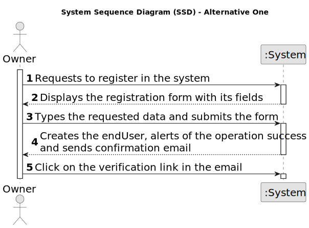
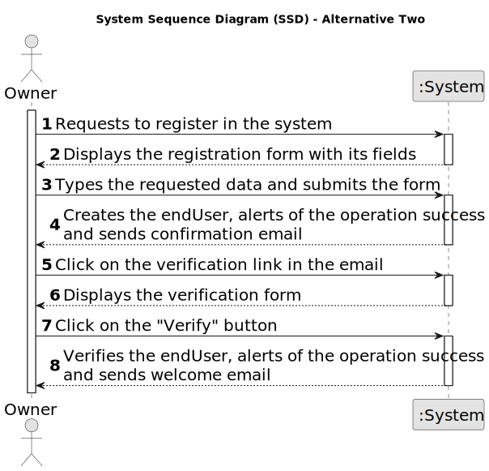

# US 007 - As an unregistered endUser, register in the system to buy, sell or rent properties

## 1. Requirements Engineering

### 1.1. User Story Description

As an unregistered endUser, I want to register in the system to buy, sell or rent
properties.

### 1.2. Customer Specifications and Clarifications 

**From the specifications document:**

> The unregister endUser must be able to register in the system to buy, sell or rent properties.

**From the client clarifications:**

> **Question:** It was previously stated that an unregistered endUser could do a property listing request. However, with the introduction of US007, I want to clarify and make sure that now a endUser needs to be registered in order to buy, sell or rent properties, or if they can still do it unregistered.
>  
> **Answer:** In Sprint B we introduce US7 and now, in US4, the owner needs to be registered in the system to submit a request for listing. You should update all artifacts to include this change.

> **Question:** When an unregistered endUser wants to register a new account in the system, the set of parameters that are asked are the following: name, citizen card number, tax number, email, phone number, and password. Do you want any extra parameters/requirements to be asked or just the ones specified above? If so, which ones are mandatory?
> 
> **Answer:** The Owner attributes are: the name, the citizen's card number, the tax number, the address, the email address and the contact telephone number. The address of the owner is not mandatory.

### 1.3. Acceptance Criteria

* **AC1:** All required fields must be filled in.
* **AC2:** The confirmation email must be sent to the endUser.
* **AC3:** The confirmation email must be accepted by the endUser in order to complete the registration.

### 1.4. Found out Dependencies

* There is a dependency to "US 003 - As a system administrator, I want to register a new employee" since an agent and a endUser are the same thing.

### 1.5 Input and Output Data

**Input Data:**

* Typed data:
	* Owner:
		* a name,
		* a citizen's card number,
		* a tax number,
		* an address,
		* an email address,
		* a contact telephone number.

**Output Data:**

* (In)Success of the operation
* Confirmation email

### 1.6. System Sequence Diagram (SSD)

**Other alternatives might exist.**

#### Alternative One

#### Alternative Two

### 1.7 Other Relevant Remarks

* n/a