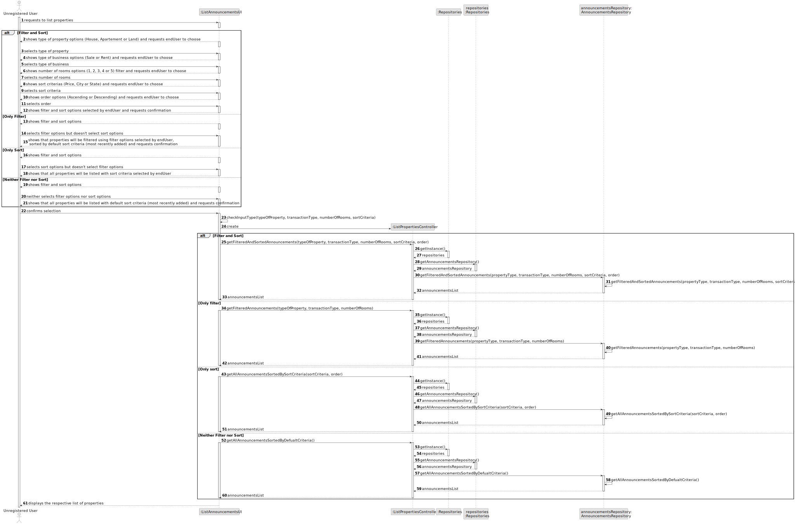
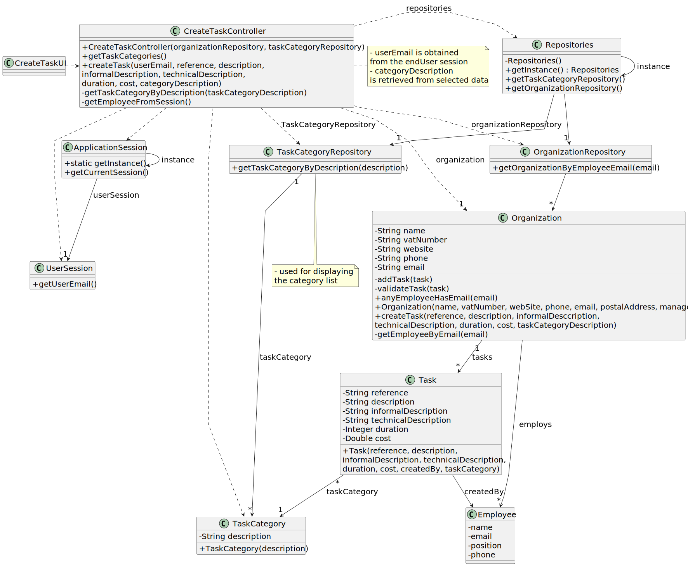

# US 001 - Display Listed Properties

## 3. Design - User Story Realization 

### 3.1. Rationale

| Interaction ID                                       | Question: Which class is responsible for...                       | Answer                   | Justification (with patterns)            |
|:-----------------------------------------------------|:------------------------------------------------------------------|:-------------------------|:-----------------------------------------|
| Step 1 : User requests to register in the System  		 | 	... requesting the users credentials?                            | RegisterUserUI           | Pure Fabrication                         |
| 		                                                   | 	... validating users input's?                                    | RegisterUserUI           | Pure Fabrication                         |
| 	Step 2 : System creates endUser 	                      | 	... coordination between users request and endUser acount creation? | RegisterUserController   | Controller                               |
|                                                      | 	... creating the endUser?                                           | AuthenticationRepository | Creater                                  |
|                                                      | 	... saving the endUser in the system?                               | UserRepository           | Information Expert, Pure Fabrication |
| Step 3 : System sends email confirmation			  		      | 	... sending a confirmation email to the endUser?                    | RegisterUserUI           | Pure Fabrication                         |

### Systematization ##

According to the taken rationale, the conceptual classes promoted to software classes are: 

 * User

Other software classes (i.e. Pure Fabrication) identified: 

 * RegisterUserUI  
 * RegisterUserController
 * AuthenticationRepository
 * UserRepository

## 3.2. Sequence Diagram (SD)

This diagram shows the full sequence of interactions between the classes involved in the realization of this endUser story.

## 3.3. Class Diagram (CD)

