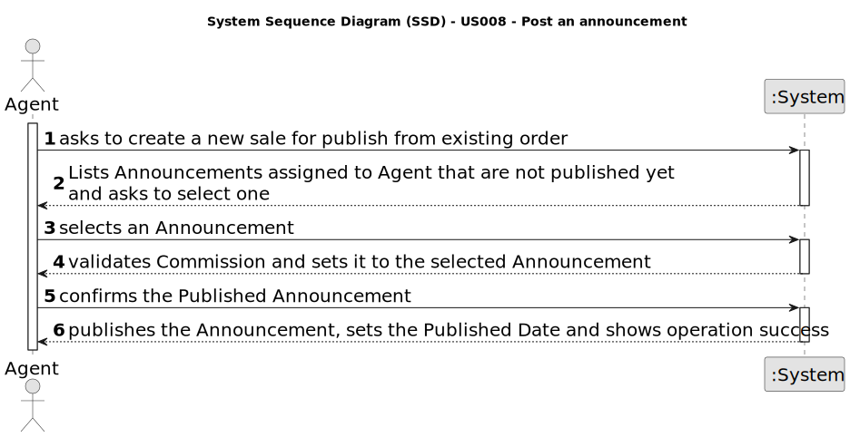

# US 008 - As an agent, I intend to see the list of property announcement requests made to myself, so that I can post the announcement.

## 1. Requirements Engineering

### 1.1. User Story Description

As an agent, I intend to see the list of property announcement requests made
to myself, so that I can post the announcement.

### 1.2. Customer Specifications and Clarifications 

**From the specifications document:**

> The agent must be able to see any property announcement requests made to and for them, so that they can post them.

**From the client clarifications:**

> **Question:** Can the agent select multiple requests at the same time? 
>  
> **Answer:** No. The agent can only post one announcement at a time.
> 
> **Question:** Regarding US008, can the agent decline an announcement request?
> 
> **Answer:** Yes. The agent must include a message justifying the rejection.
> 
> **Question:** When displaying the property announcement requests in the system to the agent besides them being ordered from most recent to oldest is there a need to display the specific day where the requests were published?
> 
> **Answer:** The list of property announcement requests should be sorted by the date they were created, with the most recent requests appearing first. The system should show the date when the property announcement requests was made.

### 1.3. Acceptance Criteria

* **AC1:** The list of property announcement requests should be sorted by the date
  they were created, with the most recent requests appearing first.
* **AC2:** An announcement is posted when a request is accepted. The list of requests
  should be refreshed, and that request should not be shown again.

### 1.4. Found out Dependencies

* There is a dependency to "US 003 - As a system administrator, I want to register a new employee" since an agent and a person are the same thing.

### 1.5 Input and Output Data

**Input Data:**

* Typed data:
	* Announcement request

**Output Data:**

* (In)Success of the operation

### 1.6. System Sequence Diagram (SSD)

**Other alternatives might exist.**

#### Alternative One

### 1.7 Other Relevant Remarks

* n/a