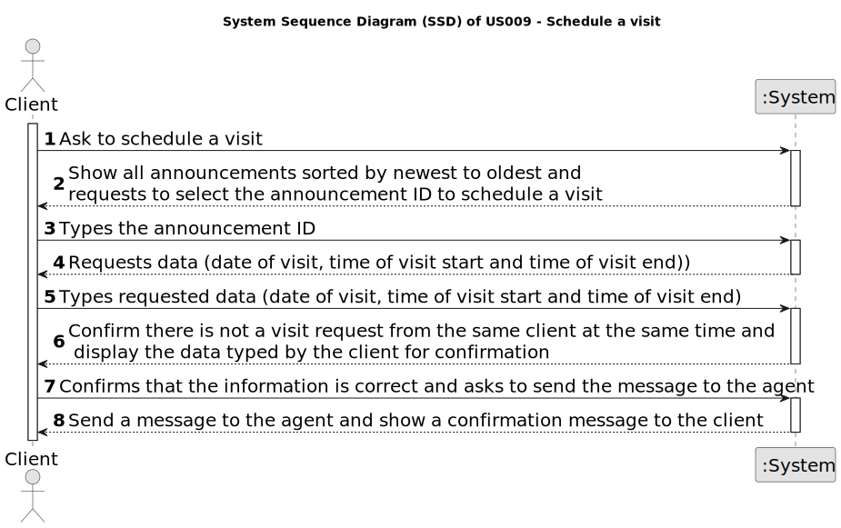

# US 009 - As a client, I want to leave a message to the agent to schedule a visit to a property of my interest

## 1. Requirements Engineering

### 1.1. User Story Description

US 009 - As a client, I want to leave a message to the agent to schedule a visit to a property of my interest

### 1.2. Customer Specifications and Clarifications 

**From the specifications document:**

>	

>	

**From the client clarifications:**

> **Question:** Q: Does the client provide (by typing) their name and phone number for the message, regardless of whether or not that information is already available to the system?

> **Answer:** The information available in the system should be used. The client does not need to type the name and phone number.

> **Question:** Is all the required data for the message typed, or is any of it selected?
>
> **Answer:** For now the information should be typed.

> **Question:**
>
> **Answer:**

> **Question:**
>
> **Answer:**

> **Question:**
>
> **Answer:**

> **Question:**
>
> **Answer:**

> **Question:**
>
> **Answer:**

> **Question:**
>
> **Answer:**

> **Question:**
>
> **Answer:**
> 
### 1.3. Acceptance Criteria

* **AC1:** A list of available properties must be shown, sorted from the most recent entries to the oldest
* **AC2:** The message must also include the client's name, phone number, preferred date and time slot (from x hour to y hour) for the property visit.
* **AC3:** A client may post multiple visit requests, but only if those do not overlap each other.
* **AC4:** The client must receive a success message when the request is valid and registered in the system.
* **AC5:** The information available in the system should be used. The client does not need to type the name and phone number
* **AC6:**

### 1.4. Found out Dependencies

* We will reuse the sort algorithm already used in US001.

### 1.5 Input and Output Data

**Input Data:**

* Typed data:
	* Date to visit
    * Time to start the visit
	* Time to end the visit
	
* Selected data:
	* Property to visit

**Output Data:**

* Message to the agent to schedule a visit
* (In)Success of the operation

### 1.6. System Sequence Diagram (SSD)

### 1.7 Other Relevant Remarks

* The agent receives the request, checks the availability and sends the response. If the customer accepts the order, it is automatically scheduled in the system.