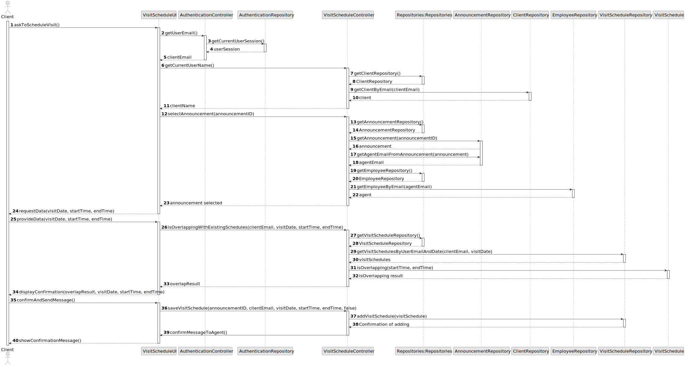
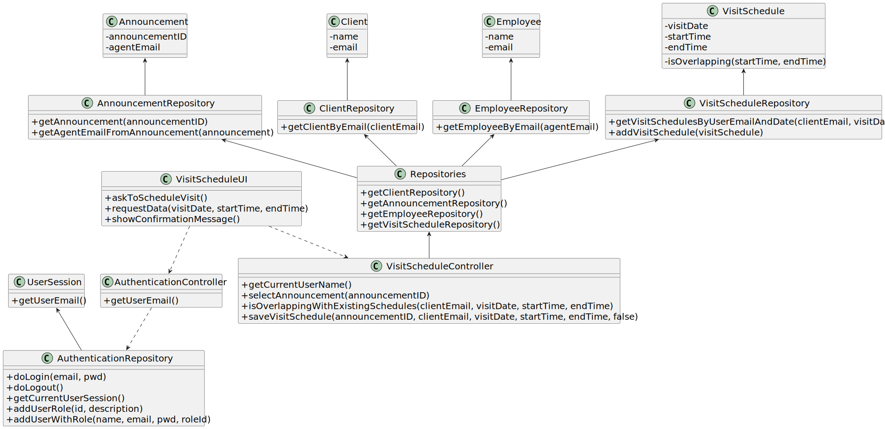

# US 009 - As a client, I want to leave a message to the agent to schedule a visit to a property of my interest

## 3. Design - User Story Realization 

### 3.1. Rationale

| Interaction ID | Question: Which class is responsible for... | Answer               | Pattern                                                                                 |
|:-------------  |:--------------------- |:---------------------|:--------------------------------------------------------------------------------------------------------------|
| Step 1  		 |	... interacting with the actor? | VisitScheduleUI         | Pure Fabrication |
| 			  		 |	... coordinating the US? | VisitScheduleController | Controller                                                                                                    |
| 			  		 |	... instantiating a new VisitSchedule? | VisitScheduleController         | Creator                                                          |
| 			  		 | ... knowing the user using the system?  | UserSession          | Information Expert                                                                          |
| Step 2  		 |	...saving the inputted data? | VisitSchedule                 | Information Expert                                                                |
| Step 3  		 |	...knowing the Announcement to show? | AnnouncementRepository               | Information Expert                                                        |
| Step 4  		 |	... saving the selected Announcement? | VisitSchedule                 | Information Expert                                                   |
| Step 5  		 |	... validating the visit schedule (local validation)? | VisitSchedule                 | Information Expert                                                                                            | 
| 			  		 |	... validating the visit schedule (global validation)? | VisitScheduleController         | Controller                                                                                      | 
| 			  		 |	... saving the created visit schedule? | VisitScheduleRepository         | Information Expert                                                                                       | 
| Step 6  		 |	... informing operation success?| VisitScheduleUI         | Pure Fabrication                                                                     | 

### Systematization ##

According to the taken rationale, the conceptual classes promoted to software classes are: 

 * VisitSchedule

Other software classes (i.e. Pure Fabrication) identified: 

 * VisitScheduleUI
 * VisitScheduleController
 * VisitScheduleRepository

## 3.2. Sequence Diagram (SD)

### Alternative 1 - Full Diagram

This diagram shows the full sequence of interactions between the classes involved in the realization of this user story.

This diagram shows the same sequence of interactions between the classes involved in the realization of this user stor.

## 3.3. Class Diagram (CD)

