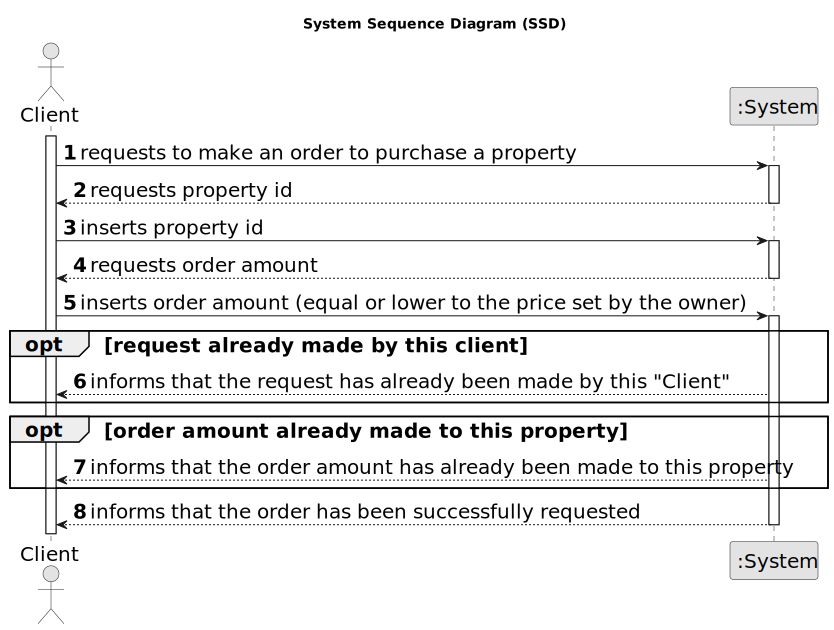

# US 010 - Place an order to purchase the property

## 1. Requirements Engineering

### 1.1. User Story Description

As a client, I place an order to purchase the property, submitting the order amount.

### 1.2. Customer Specifications and Clarifications 

**From the specifications document:**

>	When the client decides to buy/rent the property, he sends a request for the purchase/lease of the property to the agent.

**From the client clarifications:**

> **Question:**  What data is required, in addition to the order value, so that a client can place an order to purchase a property?
>  
> **Answer:** Only the order amount.
 
> **Question** When the client intends to place a purchase order, should the list of properties (announcements) be presented initially and then asked to select a property?
>
> **Answer:** The system should show a list of properties to the client.

> **Question:** Can the client remove an offer they made at any point, in order to replace it with a different one?
> 
> **Answer:** No.

> **Question:**
>
> **Answer:**

> To place an order the actor should be registered in the system.

### 1.3. Acceptance Criteria

* **AC1:** The order amount submitted by the client must be equal to or lower than the price set by the owner for the property.
* **AC2:** If the order amount submitted by the client has already been posted for the property (by another request from this client or any other client), the system must state that on the screen and the order placed previously should be considered first when selling the property.
* **AC3:**  A client can only submit a new order to purchase the same property after the previous one is declined.

### 1.4. Found out Dependencies

* There's a dependency to US011 since the orders the client places are accepted or declined by an agent.

### 1.5 Input and Output Data

**Input Data:**
	
	
* Typed data:
	* order amount

**Output Data:**

* Order request success message

### 1.6. System Sequence Diagram (SSD)

### 1.7 Other Relevant Remarks

*   