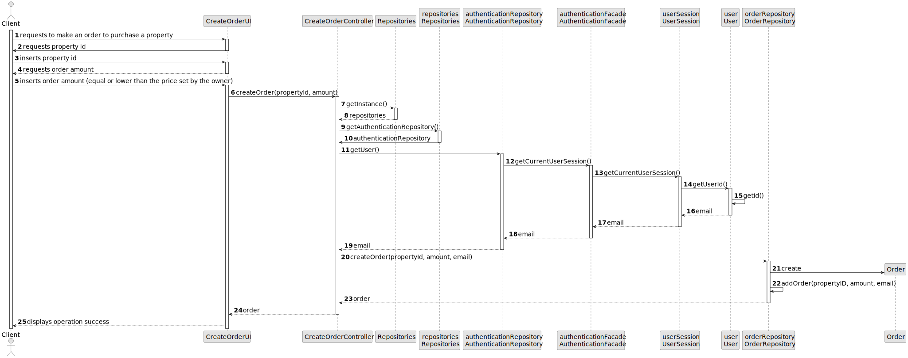
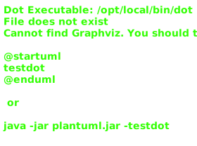

# US 010 - Place an order to purchase the property

## 3. Design - User Story Realization

### 3.1. Rationale

| Interaction ID                                       | Question: Which class is responsible for...                    | Answer                   | Justification (with patterns) |
|:-----------------------------------------------------|:---------------------------------------------------------------|:-------------------------|:------------------------------|
| Step 1 : Client requests to create purchase order 		 | 	... requesting order amount and property id to client?        | CreateOrderUI            | Pure Fabrication              |
| 		                                                   | 	... validating client input's?                                | CreateOrderUI            | Pure Fabrication              |
| Step 2 : System Creates Order                        | 	... coordination between users request and creation of order? | CreateOrderController    | Controller                    |
|                                                      | 	... storing user id?                                          | User                     | Wrapper                       |
|                                                      | 	... knowning user logged in?                                  | UserSession              | Wrapper                       |
|                                                      | 	... creating user session?                                    | AuthenticationFacade     | Wrapper                       |
|                                                      | 	... creating authentication facade?                           | AuthenticationRepository | Creator, Information Expert   |
|                                                      | 	... creating and storing orders?                              | OrderRepository          | Creator, Information Expert   |
|                                                      | 	... storing order information?                                | Order                    | Information Expert            |
| Step 3 : System displays operation success			  		    | 	... displaying the success message?                           | CreateOrderUI            | Pure Fabrication              |

### Systematization ##

According to the taken rationale, the conceptual classes promoted to software classes are:

* Order
* User (already comes with external library)

Other software classes (i.e. Pure Fabrication) identified:

* CreateOrderUI
* CreateOrderController
* OrderRepository
* AuthenticationRepository
* AuthenticationFacade
* UserSession
* User

## 3.2. Sequence Diagram (SD)

This diagram shows the full sequence of interactions between the classes involved in the realization of this user
story.

## 3.3. Class Diagram (CD)

