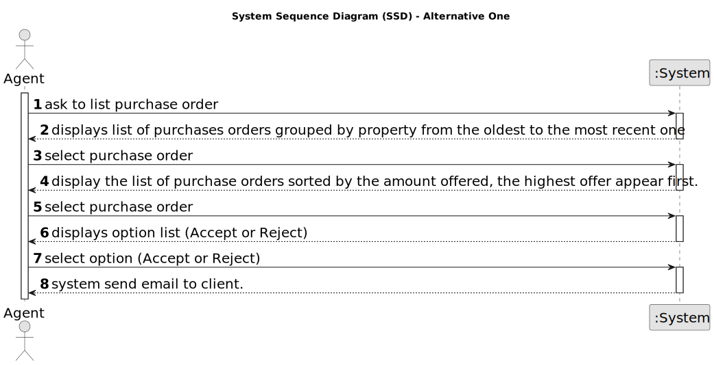

# US 011 - As an agent, I want to list real estate purchase orders to accept or decline 

## 1. Requirements Engineering

### 1.1. User Story Description

As an agent, I want to list real estate purchase orders to accept or decline a purchase order for a property. After accepting or declining, an email notification should be sent to the customer.

### 1.2. Customer Specifications and Clarifications 

**From the specifications document:**

> As an agent, I want to list real estate purchase orders to accept or decline a purchase order for a property. After accepting or declining, an email notification should be sent to the customer.

**From the client clarifications:**

> **Question:** When the agent declines an order, she has to be removed from the list and system?
>  
> **Answer:** The order should be removed from the list but not from the system.

> **Question:** 
>
> **Answer:** 

> **Question:**
>
> **Answer:**

> **Question:**
>
> **Answer:**

> **Question:**
>
> **Answer:**

> **Question:**
>
> **Answer:**

> **Question:**
>
> **Answer:**

> **Question:**
>
> **Answer:**
### 1.3. Acceptance Criteria

* **AC1:** All required fiels must be filled in.
* **AC2:** The list of purchase orders should be grouped by property. The properties should be sorted from the oldest to the most recent one. For each property, the list of purchase orders should be sorted by the amount offered, the highest offer must appear first.
* **AC3:** For each offer, the agent must be able to accept or decline it. The action of accepting or declining an offer should trigger an email notification to the client. 
* **AC4:** When a purchase order is accepted, all the other orders should be declined, and a message sent to the client.
* **AC5:** If a property does not contain any offers, the system should show an empty list of offers.
* **AC6:**

### 1.4. Found out Dependencies

* There is a dependency to "US 003 - As a system administrator, I want to register a new employee" since the choice of agent depends on its creation.

### 1.5 Input and Output Data

**Input Data:**

* Typed data:
	*
      
* Selected data:
	* Property type (filter)
	* Price (sort)

**Output Data:**

* send email notification to customer with pending proposal regardless of accepted or rejected proposal

### 1.6. System Sequence Diagram (SSD)

**Other alternatives might exist.**

#### Alternative One

#### Alternative Two

### 1.7 Other Relevant Remarks

* 