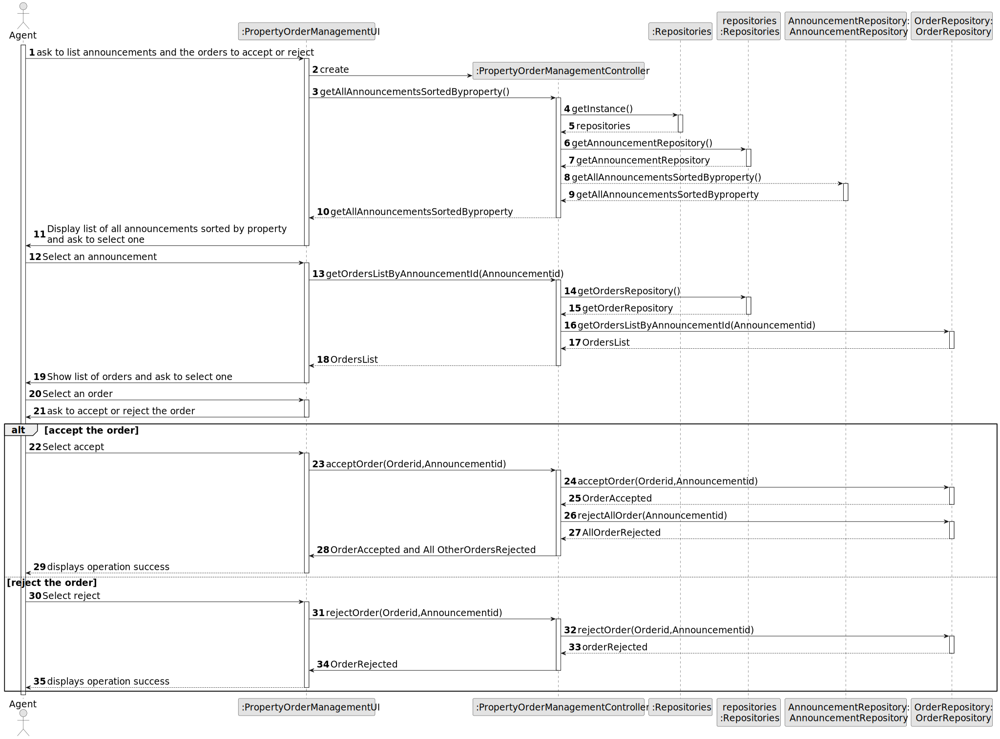
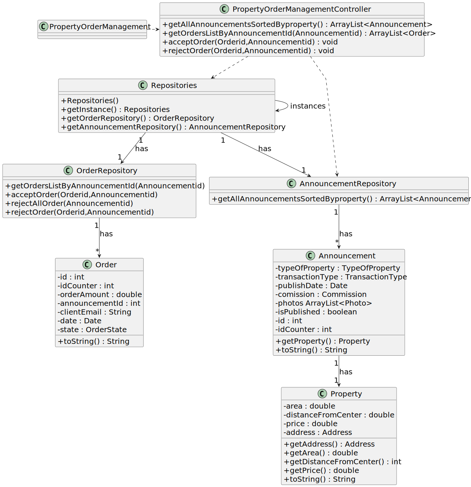

# US 011 - As an agent, I want to list real estate purchase orders to accept or decline

## 3. Design - User Story Realization 

### 3.1. Rationale

**SSD - Alternative 1 is adopted.**

| Interaction ID                                           | Question: Which class is responsible for...          | Answer                                    | Justification (with patterns)                              |
|:---------------------------------------------------------|:-----------------------------------------------------|:------------------------------------------|:-----------------------------------------------------------|  
| Step 1 : start to list announcements to accept or reject | ... interacting with the actor?                      | PropertyOrderManagementUI                 | Pure Fabrication                                           |
| 	                                                        | ... coordinating the US?                             | PropertyOrderManagementController         | Controller                                                 |
| 	                                                        | ... knowing the list of announcements in the system? | AnnouncementRepository                    | IE: knows all the data needed to list.                     |
| 	                                                        | ... knowing the list of orders in the system?        | OrderRepository                           | IE: knows all the data needed to list.                     |
| Step 2: manage orders                                    | ... accet or reject order?                           | PropertyOrderManagementController                          | Pure Fabrication                                           |
| Step 2: manage orders                                     |  ...                                          |                                                           | Pure Fabrication                                           |
| Step 2: manage orders                           | ...                                          |                           | Pure Fabrication                                           |
|Step 2: manage orders                                       |  ...                                          |                         | Pure Fabrication                                           |
| Step 6: reject order                                     | ...                                          | PropertyOrderManagementController                         | Pure Fabrication                                           |
| Step 7: accept Order                                     | ...                                          | PropertyOrderManagementController                         | Pure Fabrication                                           |
| Step 3 : System displays operation success	              | ... informing operation success?                     | CreateRequestUI                           | Pure Fabrication

### Systematization ##

According to the taken rationale, the conceptual classes promoted to software classes are: 

 * Announcement

Other software classes (i.e. Pure Fabrication) identified: 

 * PropertyOrderManagementUI
 * PropertyOrderManagementController

## 3.2. Sequence Diagram (SD)

### Full Diagram

This diagram shows the full sequence of interactions between the classes involved in the realization of this person story.

## 3.3. Class Diagram (CD)

