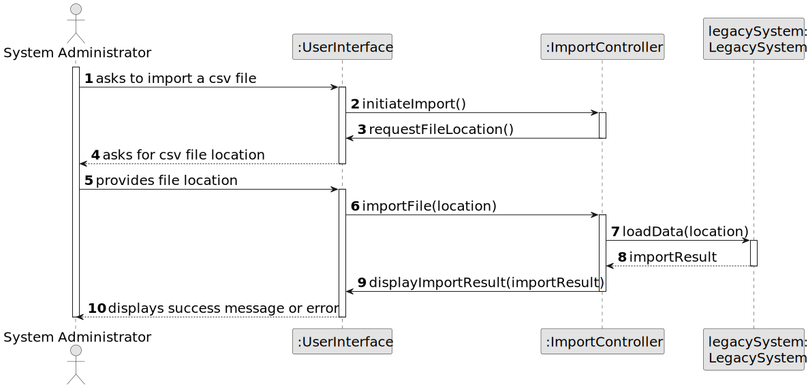
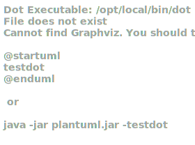

# US 012 - I want to import information from a legacy system

## 3. Design - User Story Realization 

### 3.1. Rationale

| Interaction ID | Question: Which class is responsible for...                       | Answer                       | Patterns                                                    |
|:---------------|:------------------------------------------------------------------|:-----------------------------|:------------------------------------------------------------|
| Step 1  		     | 	... interacting with the actor?                                  | ImportInformationUI          | Pure Fabrication                                            |
| 			  		        | 	... coordinating the US?                                         | ImportInformationController  | Controller                                                  |
| 			  		        | 	... requesting the file location?                                | ImportInformationController  | Information Expert                                          |
| Step 2  		     | 	.. providing the file location?	                                 | SystemAdministrator          | Information Expert                                          |
| 		             | 	... processing the import request?                               | ImportInformationController                         | Information Expert                                          |
| Step 3  		     | 	... loading the data from the file?                              | LegacySystem                       | Information Expert       |
| Step 4  		     | 	... displaying the success message?                              | ImportInformationUI                         | Information Expert |

### Systematization ##

According to the taken rationale, the conceptual classes promoted to software classes are: 

 * LegacySystem

Other software classes (i.e. Pure Fabrication) identified: 

 * ImportInformationUI  
 * ImportInformationController

## 3.2. Sequence Diagram (SD)

### Alternative 1 - Full Diagram

This diagram shows the full sequence of interactions between the classes involved in the realization of this user story.

## 3.3. Class Diagram (CD)

