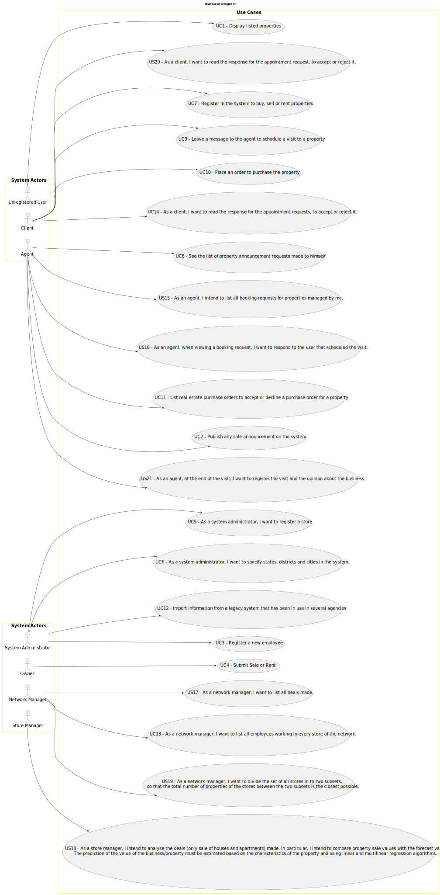

# Use Case Diagram (UCD)

**In the scope of this project, there is a direct relationship of _1 to 1_ between Use Cases (UC) and User Stories (US).**

[//]: # (However, be aware, this is a pedagogical simplification. On further projects and curricular units might also exist _1 to)

[//]: # (N **and/or** N to 1 relationship between US and UC.)

[//]: # ()
[//]: # (**Insert below the Use Case Diagram in a SVG format**)

[//]: # (**For each UC/US, it must be provided evidences of applying main activities of the software development process &#40;)

[//]: # (requirements, analysis, design, tests and code&#41;. Gather those evidences on a separate file for each UC/US and set up a)

[//]: # (link as suggested below.**)

# Use Cases / User Stories

| UC/US  | Description                                                                                                                                                                                                                                                                                                                                                                        |                   
|:-------|:-----------------------------------------------------------------------------------------------------------------------------------------------------------------------------------------------------------------------------------------------------------------------------------------------------------------------------------------------------------------------------------|
| US 001 | [As an unregistered user, I want to display listed properties](../../us001/Readme.md)                                                                                                                                                                                                                                                                                              |
| US 002 | [As an agent, I can publish any sale announcement on the system, for example received through a phone call](../../us002/Readme.md)                                                                                                                                                                                                                                                 |
| US 003 | [As a system administrator, I want to register a new employee](../../us003/Readme.md)                                                                                                                                                                                                                                                                                              |
| US 004 | [As an owner, I intend to submit a request for listing a property sale or rent, choosing the responsible agent](../../us004/Readme.md)                                                                                                                                                                                                                                             |
| US 007 | [As an unregistered user, I want to register in the system to buy, sell or rent properties](../../us007/Readme.md)                                                                                                                                                                                                                                                                 |
| US 008 | [As an agent, I intend to see the list of property announcement requests made to myself, so that I can post the announcement](../../us008/Readme.md)                                                                                                                                                                                                                               |
| US 009 | [As a client, I want to leave a message to the agent to schedule a visit to a property of my interest](../../us009/Readme.md)                                                                                                                                                                                                                                                      |
| US 010 | [As a client, I place an order to purchase the property, submitting the order amount](../../us010/Readme.md)                                                                                                                                                                                                                                                                       |
| US 011 | [As an agent, I want to list real estate purchase orders to accept or decline a purchase order for a property. After accepting or declining, an email notification should be sent to the customer](../../us011/Readme.md)                                                                                                                                                          |
| US 012 | [As a system administrator, I want to import information from a legacy system that has been in use in several agencies](../../us012/Readme.md)                                                                                                                                                                                                                                     |
| US 015 | [As an agent, I intend to list all booking requests for properties managed by me](../../us015/Readme.md)                                                                                                                                                                                                                                                                           |
| US 016 | [As an agent, when viewing a booking request, I want to respond to the user that scheduled the visit](../../us016/Readme.md)                                                                                                                                                                                                                                                       |
| US 017 | [As a network manager, I want to list all deals made](../../us017/Readme.md)                                                                                                                                                                                                                                                                                                       |
| US 018 | [As a store manager, I intend to analyse the deals (only sale of houses and apartments) made. In particular, I intend to compare property sale values with the forecast values. The prediction of the value of the business/property must be estimated based on the characteristics of the property and using linear and multilinear regression algorithms](../../us018/Readme.md) |
| US 019 | [As a network manager, I want to divide these to fall stores into two subsets, so that the total number of properties of the stores between the two subsets is the closest possible](../../us019/Readme.md)                                                                                                                                                                        |
