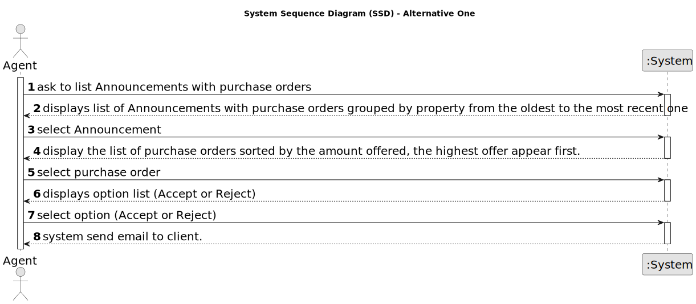

# US 011 - As an agent, I want to list real estate purchase orders to accept or decline 

## 1. Requirements Engineering

### 1.1. User Story Description

As an agent, I want to list real estate purchase orders to accept or decline a purchase order for a property. After accepting or declining, an email notification should be sent to the customer.

### 1.2. Customer Specifications and Clarifications 

**From the specifications document:**

> As an agent, I want to list real estate purchase orders to accept or decline a purchase order for a property. After accepting or declining, an email notification should be sent to the customer.

**From the client clarifications:**

> **Question:** When the agent declines an order, she has to be removed from the list and system?
>  
> **Answer:** The order should be removed from the list but not from the system.

> **Question:** : Regarding US011 should we provide all the property characteristics to assist agents in choosing the appropriate purchase order? If so, is it required to display the amount established by the property owner?
>
> **Answer:** Yes. Yes.

> **Question:** Is it convenient to give the ability to filter the properties by their attributes when the agent is listing them?
>
> **Answer:** We always have a low number of purchase orders. Please check AC1

> **Question:** The notification should be sent to the client, but we need to consider this client the owner or the potential buyer?
>
> **Answer:** The client is the registered user that placed the order (in US10).

> **Question:** Assuming the previous anwser is the potential buyer, should the owner be informed about the sale success?
>
> **Answer:** The owner will be contacted by means of a phone call. This is not a feature of the system.

### 1.3. Acceptance Criteria

* **AC1:** The list of purchase orders should be grouped by property. The properties should be sorted from the oldest to the most recent one. For each property, the list of purchase orders should be sorted by the amount offered, the highest offer must appear first.
* **AC2:** For each offer, the agent must be able to accept or decline it. The action of accepting or declining an offer should trigger an email notification to the client. 
* **AC3:** When a purchase order is accepted, all the other orders should be declined, and a message sent to the client.
* **AC4:** If a property does not contain any offers, the system should show an empty list of offers.

### 1.4. Found out Dependencies

* There is a dependency to "US 010 - Place an order to purchase the property" since the choice of orders depends on its creation.

### 1.5 Input and Output Data

**Input Data:**

* Selected data:
	* Announcemnt (property)
	* Order 

**Output Data:**

* send email notification to customer with pending proposal regardless of accepted or rejected proposal

### 1.6. System Sequence Diagram (SSD)

#### Alternative One

### 1.7 Other Relevant Remarks

* 