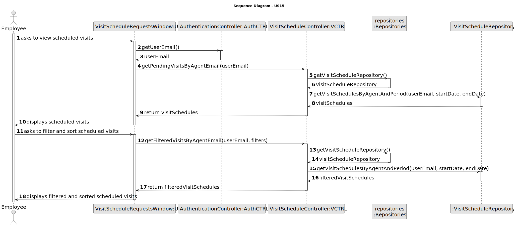
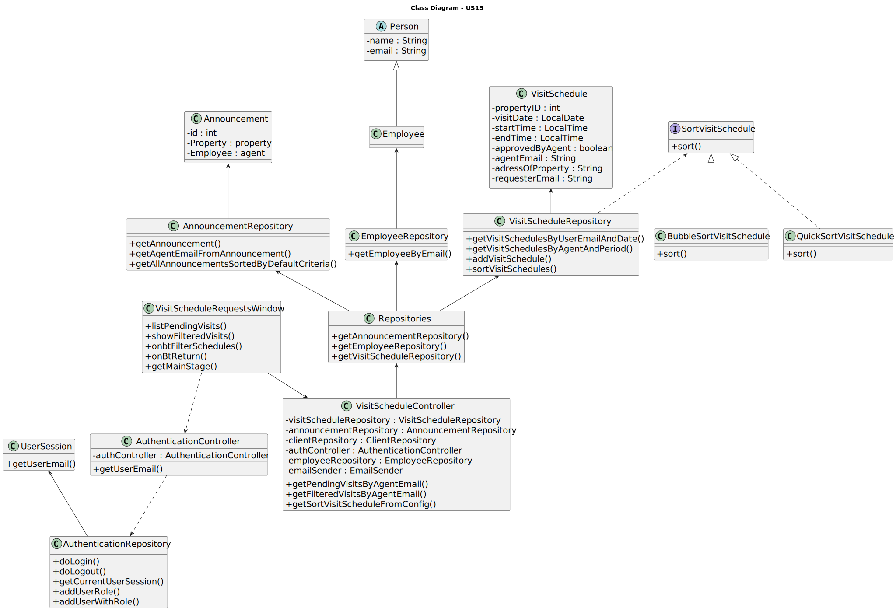

# US 012 - I want to import information from a legacy system

## 3. Design - User Story Realization 

### 3.1. Rationale

| Interaction ID | Question: Which class is responsible for...                       | Answer                 | Patterns           |
|:---------------|:------------------------------------------------------------------|:-----------------------|:-------------------|
| Step 1  		     | 	... interacting with the actor?                                  | ImportUI               | Pure Fabrication   |
| 			  		        | 	... coordinating the US?                                         | ImportController       | Controller         |
| 			  		        | 	... requesting the file location?                                | ImportUI               | Pure Fabrication   |
| Step 2  		     | 	.. providing the file location?	                                 | ImportUI               | Pure Fabrication   |
| 		             | 	... processing the import request?                               | ImportController       | Controller         |
| Step 3  		     | 	... loading the data from the file?                              | AnnouncementRepository | Information Expert |
| Step 4  		     | 	... displaying the success message?                              | ImportUI               | Pure Fabrication   |

[//]: # (### Systematization ##)

[//]: # (According to the taken rationale, the conceptual classes promoted to software classes are: )

[//]: # ()
[//]: # ( * LegacySystem)

[//]: # (Other software classes &#40;i.e. Pure Fabrication&#41; identified: )

[//]: # ()
[//]: # ( * ImportUI  )

## 3.2. Sequence Diagram (SD)

### Full Diagram

This diagram shows the full sequence of interactions between the classes involved in the realization of this user story.

## 3.3. Class Diagram (CD)

