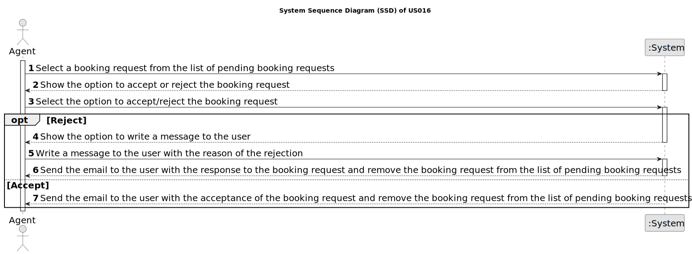

# US016 - As an agent, when viewing a booking request, I want to respond to the user that scheduled the visit.

## 1. Requirements Engineering

### 1.1. User Story Description

As an agent, when viewing a booking request, I want to respond to the user that scheduled the visit.

### 1.2. Customer Specifications and Clarifications 

**From the specifications document:**

* The users should use a graphical user interface to access the features introduced in Sprint D.

* The application should use object serialization to ensure persistence of the data between two runs of the application. Serialization must be applied to all classes developed in all sprints.

**From the client clarifications:**

> **Question:** 
>  
> **Answer:** 

> **Question:** 
>  
> **Answer:** 

### 1.3. Acceptance Criteria

* **AC1:** The response is sent by email.
* **AC2:** Different email services can send the message. These services must be configured using a configuration file to enable using different platforms (e.g.: gmail, DEI's email service, etc.)
* **AC3:** The response should include the name and phone number of the responsible Agent.
* **AC4:** The response should include the property identification and location.
* **AC5:** When an Agent responds to a booking request the list of booking requests should be updated to not show this request.

### 1.4. Found out Dependencies

* US009 - As a client, I want to leave a message to the agent to schedule a visit to a property of my interest. - **Must be implemented before this user story.**
* As an agent, I intend to list all booking requests for properties managed by me - **Must be implemented before this user story.**

### 1.5 Input and Output Data

**Input Data:**

* Typed data:
  * Reason for rejecting the booking request
* Selected data:
  * Selection of the booking request to be responded to

**Output Data:**

* (In)Success of the operation

### 1.6. System Sequence Diagram (SSD)

### 1.7 Other Relevant Remarks

* 