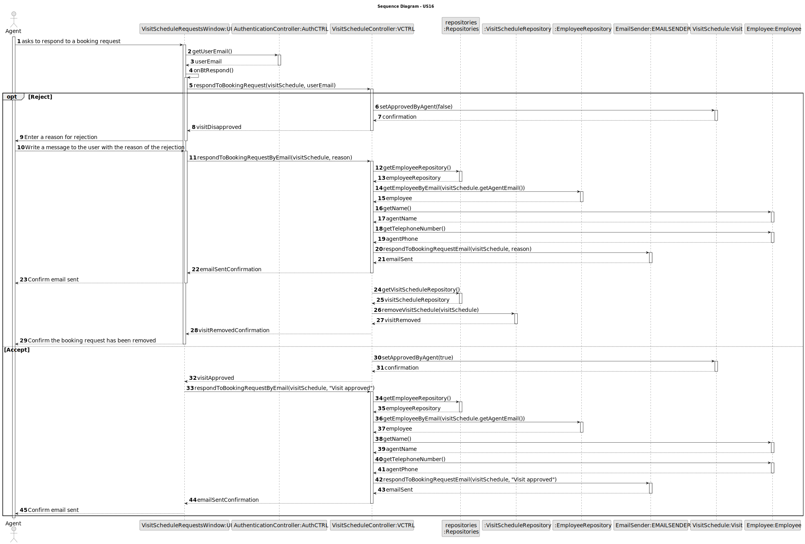
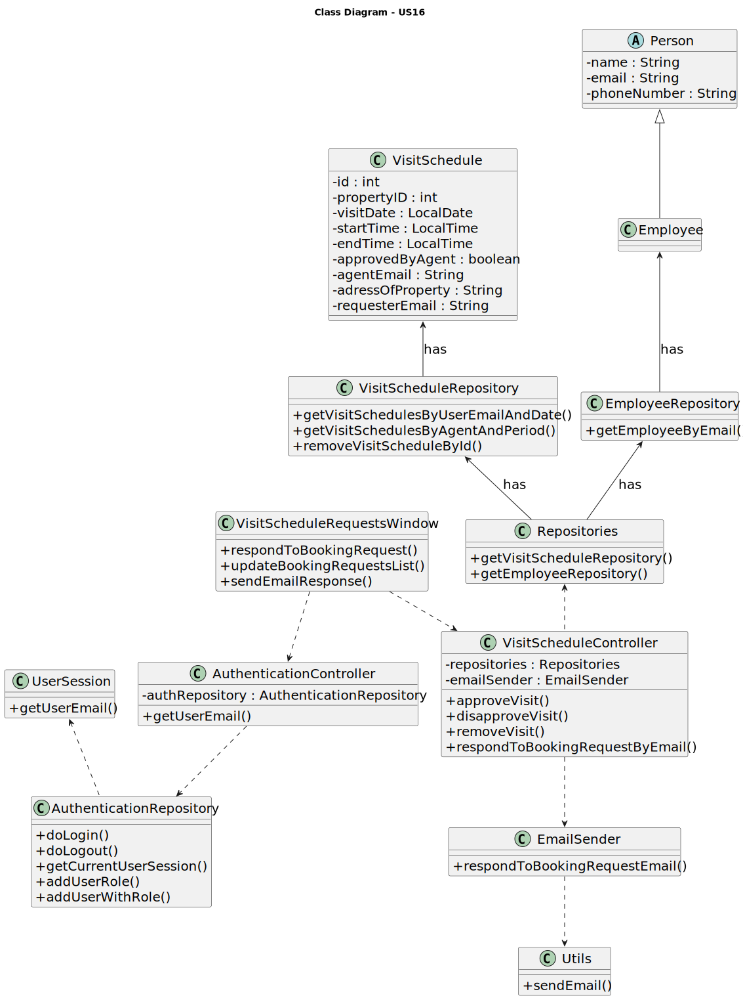

# US016 - As an agent, when viewing a booking request, I want to respond to the user that scheduled the visit.

## 3. Design - User Story Realization 

### 3.1. Rationale

| Interaction ID | Question: Which class is responsible for...                          | Answer                          | Patterns              |
|:--------------:|:-------------------------------------------------------------------:|:-------------------------------:|:---------------------:|
| Step 1         | ... interacting with the actor?                                     | VisitScheduleRequestsWindow (UI)| Pure Fabrication      |
|                | ... coordinating the US?                                            | VisitScheduleController (VCTRL) | Controller            |
|                | ... requesting the current user's email?                            | AuthenticationController (AuthCTRL)| Information Expert|
| Step 2         | ... providing the current user's email?                             | AuthenticationController (AuthCTRL)| Information Expert|
|                | ... processing the request for responding to a booking request?      | VisitScheduleController (VCTRL) | Controller            |
| Step 3         | ... obtaining the employee's details by email?                      | EmployeeRepository (EREPO)     | Information Expert   |
| Step 4         | ... sending the response email?                                     | EmailSender (EMAILSENDER)       | Pure Fabrication      |
|                | ... updating the booking request status?                            | VisitSchedule (Visit)           | Information Expert   |
| Step 5         | ... requesting the removal of the responded booking request?        | VisitScheduleController (VCTRL) | Controller            |
| Step 6         | ... removing the responded booking request?                         | VisitScheduleRepository (VSREPO)| Information Expert   |
| Step 7         | ... updating the UI after the booking request is responded?         | VisitScheduleRequestsWindow (UI)| Pure Fabrication      |

## 3.2. Sequence Diagram (SD)

### Full Diagram

This diagram shows the full sequence of interactions between the classes involved in the realization of this user story.

## 3.3. Class Diagram (CD)

