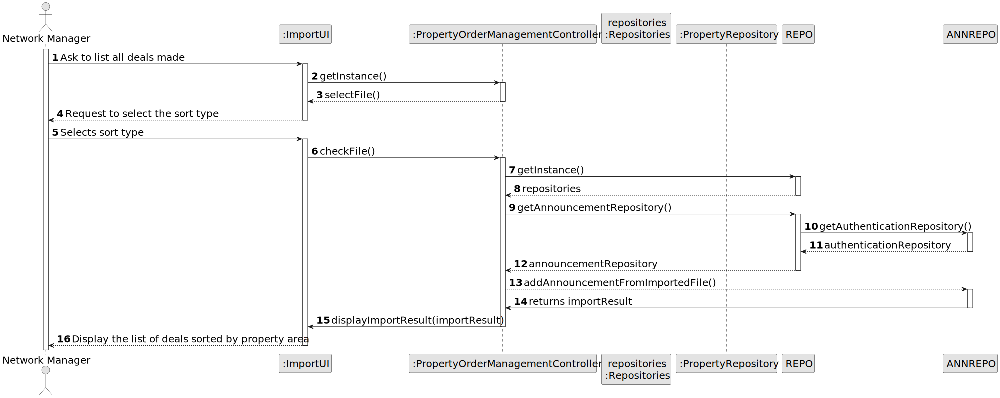
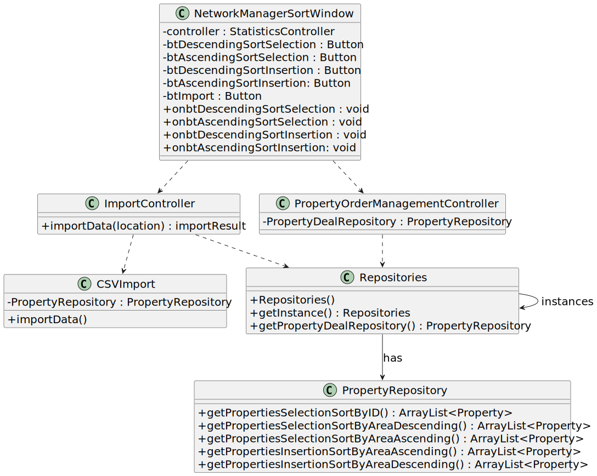

# US 017 - As a network manager, I want to list all deals made.

## 3. Design - User Story Realization

### 3.1. Rationale

| Interaction ID                                               | Question: Which class is responsible for...                                                  | Answer                                    | Patterns                    |
|:-------------------------------------------------------------|:---------------------------------------------------------------------------------------------|:------------------------------------------|:----------------------------|
| Step 1 : list all properties with deals made?		        | ... interacting with the actor?                                                              | NetworkManagerSortWindow                  | Pure Fabrication                       |
| 	                                                            | ... coordinating the US?                                                                     | PropertyOrderManagementController         | Controller                             |
|                                                              | 	...  Displaying option to sort all properties by property area (square feet)?              | NetworkManagerSortWindow                  | Pure Fabrication            |
| 			  		                                            | 	... Displaying option to either import file to sort all propreties with deals made?        | NetworkManagerSortWindow                  | Pure Fabrication            |
| 			  		                                            | 	...  Importing a file?                                                                     | CSVImport                                 | Pure Fabrication            |
| 		                                                        | 	... Coordinating file import?                                                              | ImportController                          | Controller                  |
| Step 2 : Sort properties 		                            | 	... Displaying sort options?                                                               | NetworkManagerSortWindow                  | Pure Fabrication            |
| 		                                                        | 		... Storing properties with deals by area?                                             | PropertyRepository                        |Information Expert          |
| 		                                                        | 	...                                                                                        | StatisticsController                      | Controller                  |
| Step 3: Displaying properties to Network Manager 		    | 	... Displaying the list?                                                                   | NetworkManagerSortWindow                  | Pure Fabrication            |

### Systematization ##

Software classes (i.e. Pure Fabrication) identified:

* NetworkManagerSortWindow
* PropertyOrderManagementController
* PropertyRepository
* ImportController
* CSVImport

## 3.2. Sequence Diagram (SD)

This diagram shows the full sequence of interactions between the classes involved in the realization of this user story.

## 3.3. Class Diagram (CD)

