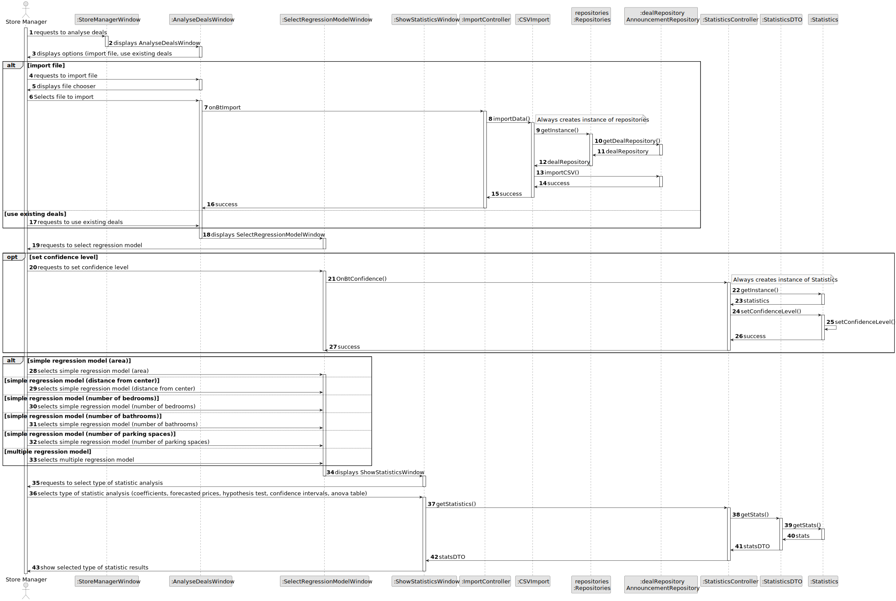
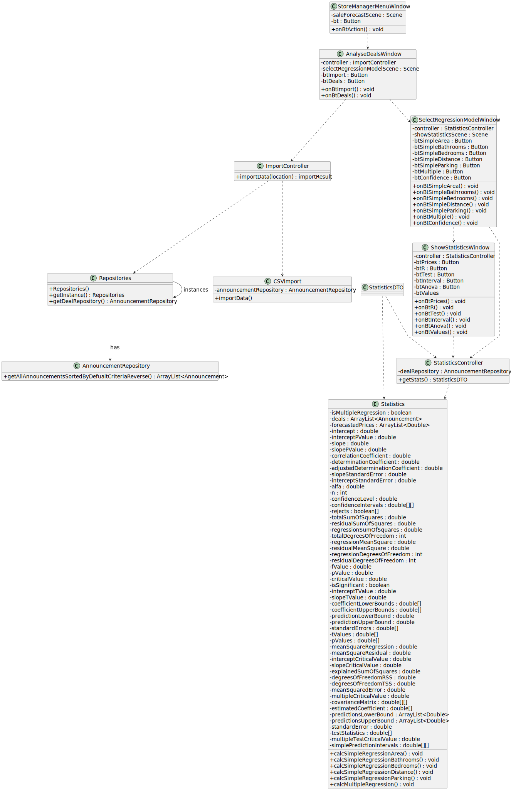

# US 018 - As a store manager, I intend to analyse the deals made.

## 3. Design - User Story Realization 

### 3.1. Rationale

| Interaction ID                                       | Question: Which class is responsible for...                             | Answer                      | Patterns                    |
|:-----------------------------------------------------|:------------------------------------------------------------------------|:----------------------------|:----------------------------|
| Step 1 : Store Manager requests to analyse deals  		 | 	...  Displaying option to analyse deals?                               | StoreManagerWindow          | Pure Fabrication            |
| 			  		                                              | 	... Displaying option to either import file or anaylse existing deals? | AnalyseDealsWindow          | Pure Fabrication            |
| 			  		                                              | 	...  Importing a file?                                                 | CSVImport                   | Pure Fabrication            |
| 		                                                   | 	... Coordinating file import?                                          | ImportController            | Controller                  |
| 		                                                   | 	... Storing deals?                                                     | AnnouncementRepository      | Creator, Information Expert |
| 		                                                   | 	... Coordinating retrieval of deals?                                   | StatisticsController        | Controller                  |
| 		                                                   | 	... Displaying regression model options?                               | SelectRegressionModelWindow | Pure Fabrication            |
| Step 2 : Analysing Deals		                           | 	... Displaying options for type of statistic analysis?                 | ShowStatisticsWindow        | Pure Fabrication            |
| 		                                                   | 	... Making statistic calculations?                                     | Statistics                  | Pure Fabrication            |
| 		                                                   | 	... Coordination between user request and statistic calculations?      | StatisticsController        | Controller                  |
| Step 3: Displaying results to Store Manager 		       | 	... Displaying the results?                                            | ShowStatisticsWindow        | Pure Fabrication            |

### Systematization ##

Software classes (i.e. Pure Fabrication) identified:

* StoreManagerWindow
* AnalyseDealsWindow
* SelectRegressionModelWindow
* ShowStatisticsWindow
* ImportController
* StatisticsController
* Statistics
* CSVImport
* AnnouncementRepository

## 3.2. Sequence Diagram (SD)

This diagram shows the full sequence of interactions between the classes involved in the realization of this user story.

## 3.3. Class Diagram (CD)

