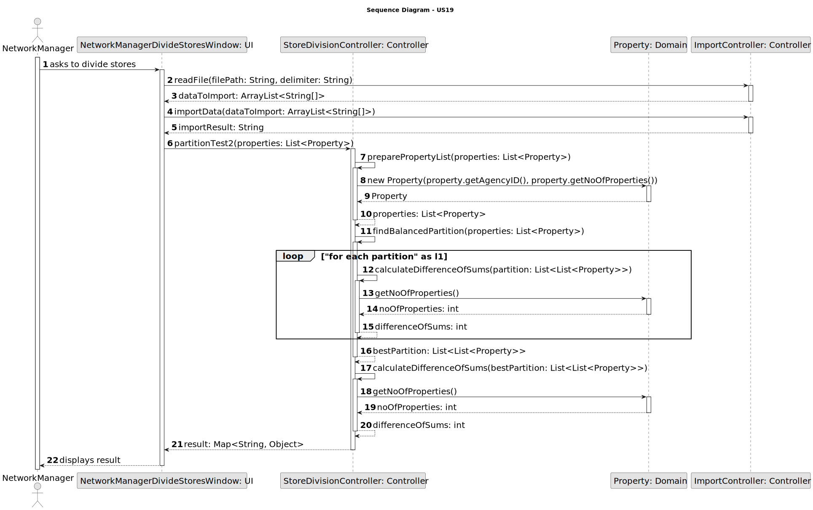
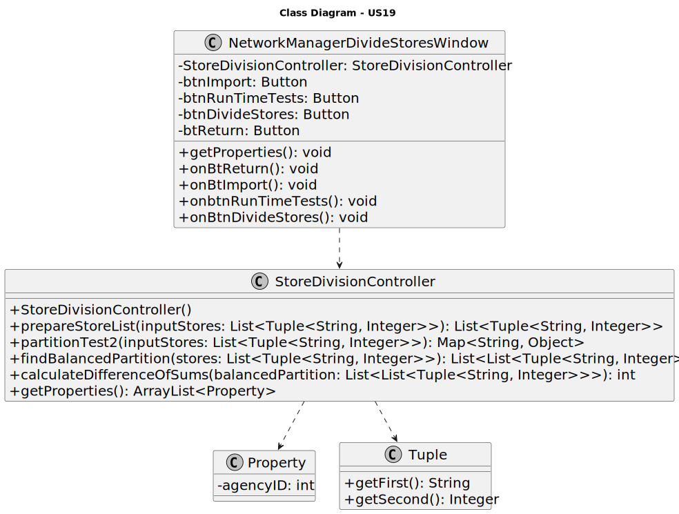

# US 019 -  As a network manager, I want to divide the set of all stores into two subsets

## 3. Design - User Story Realization 

### 3.1. Rationale

| Interaction ID | Question: Which class is responsible for...    | Answer                 | Patterns           |
|:---------------|:------------------------------------------------|:-----------------------|:-------------------|
| Step 1         | ... interacting with the actor?                 | NetworkManagerDivideStoresWindow (UI) | Pure Fabrication   |
|                | ... coordinating the US?                        | StoreDivisionController (Controller)  | Controller         |
|                | ... preparing the store list?                   | StoreDivisionController (Controller)  | Controller         |
| Step 2         | ... confirming the store list?                  | NetworkManagerDivideStoresWindow (UI) | Pure Fabrication   |
|                | ... partitioning the stores?                    | StoreDivisionController (Controller)  | Controller         |
| Step 3         | ... calculating the difference of sums?         | StoreDivisionController (Controller)  | Controller         |
| Step 4         | ... displaying the result?                      | NetworkManagerDivideStoresWindow (UI) | Pure Fabrication   |

## 3.2. Sequence Diagram (SD)

### Full Diagram

This diagram shows the full sequence of interactions between the classes involved in the realization of this user story.

## 3.3. Class Diagram (CD)

